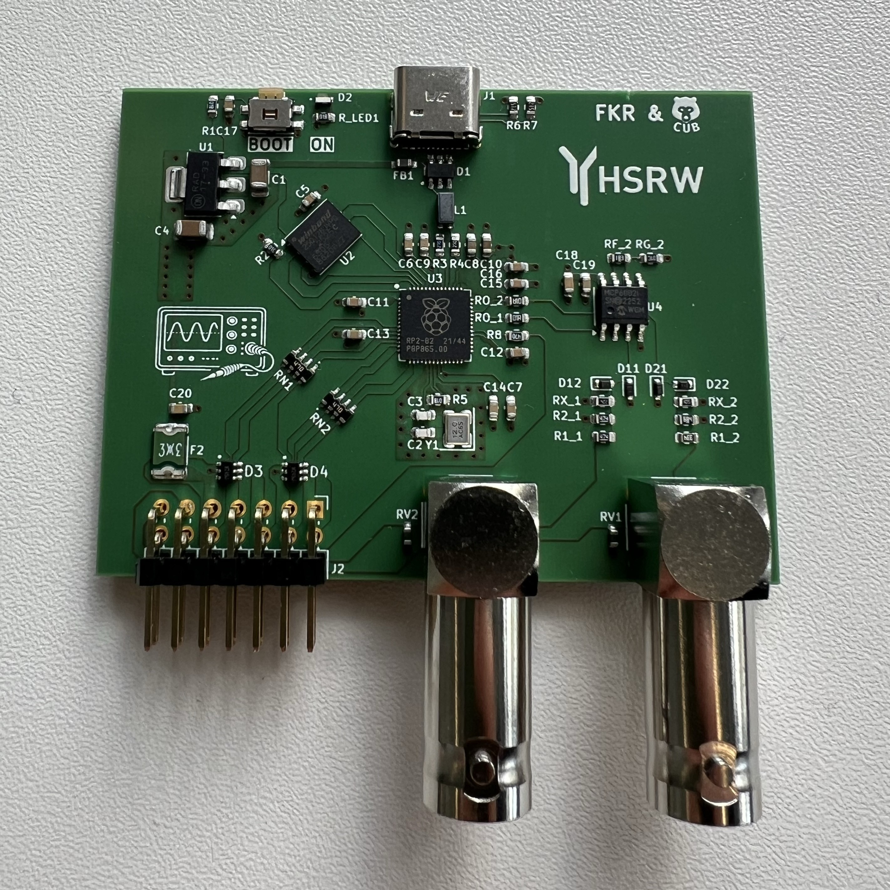
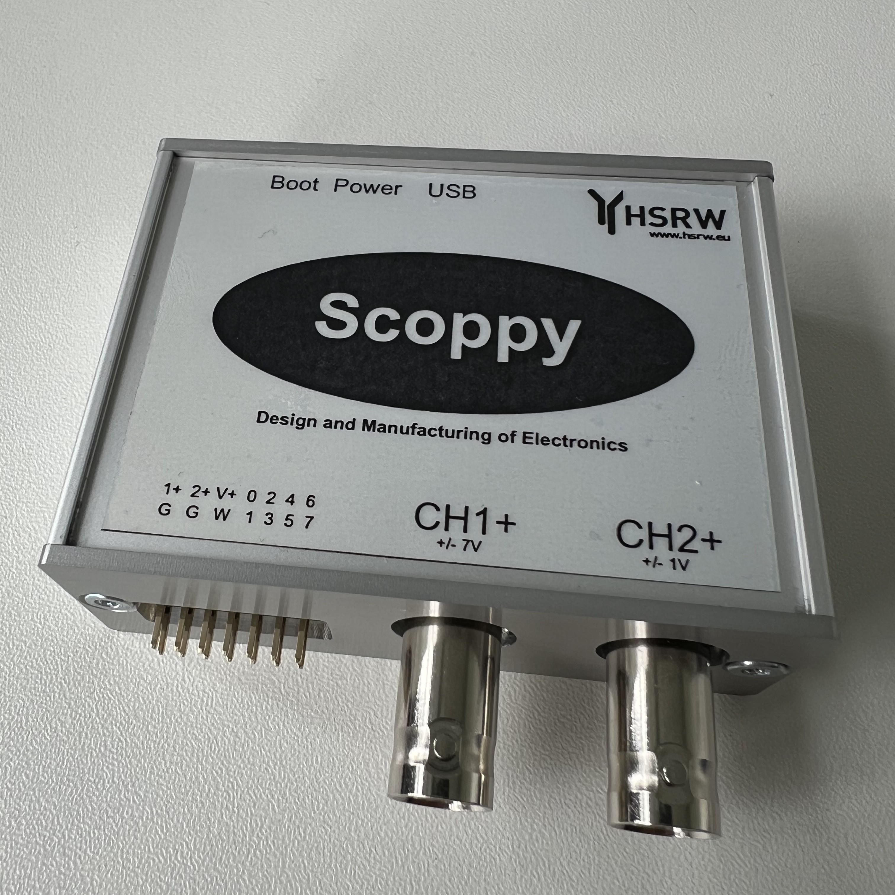

# Scoppy 

## Overview
Scoppy is an hardware extension project designed to be compatible with the [original Scopy Project](https://github.com/fhdm-dev/scoppy) developed by fhdm-dev. This repository extends the original Raspberry Pi Pico oscilloscope software by providing custom hardware developed as teaching material for the course Design and Manufacturing of Electronics.

The hardware platform enables students to study and manufacture a complete measurement instrument while using the original Scoppy firmware.

<!-- To-do: Add more photos to the list -->

 
   
   

 

Key Features
- Oscilloscope
- Logic analyzer
- Function generator

---

## Project Structure

| Folder | Description | Contents |
|--------|-------------|-------------|
| **CAD_files** | Case drawings and pcb | .pdf and .step |
| **ECAD_files** | Contains PCB files | Original design and student template  |
| **Images** | Report relevant snippets | Images |
| **Waveforms** | Waveforms Testing Workspace | .dwf3work |

---

## Testing

Images of Scoppy in action.

 
   
   

  

---
## Firmware

Original project can be found at: 
[Github](https://github.com/fhdm-dev/scoppy) 
[EasyEDA](https://easyeda.com/editor#id=5d5f637d6a8448b59f484372ed679191) 
[Website](https://oscilloscope.fhdm.xyz/)  
 
---
## Getting Started

From the [Scoppy Firmware downloads](https://oscilloscope.fhdm.xyz/wiki/firmware-versions) download and flash the **scoppy-pico-v18.uf2** .

---
## Future Work 
C17 capacitor can be omited or not populated. It is the boot push-button debounce capacitor and in some layouts prevents proper booting persumably because the **RUN** pin is left floating so the code starts running while the capacitor is still charging and before **BOOT** pin reaches logic high. 

---
## Acknowledgements

This project would not have been possible without the original Scoppy software created by the fhdm-dev team. Their work provided the foundation that made this hardware implementation possible.
---
## Author

Developed by **cubeli27** with the support of Frank Kremer (FKR)
For questions or collaboration, feel free to reach out. See my contact info in the [profile repo](https://github.com/cubeli27/cubeli27).
